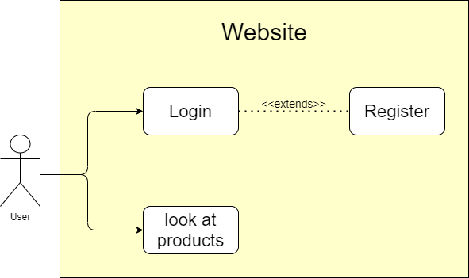

# Website Name
## Use Case Diagram

## Use Case Description

## User Stories

## Functional Requirements

- Registartion: A user has to be able to register, 
this data needs to be stored and accessible the next time the user visits the website.
- Login: A user has to be able to login, after he has registered himself earlier,
by using his username/email and password.

## Non-Functional Requirements

- Privacy: The stored user data must be kept private and only be accessible for the user.
The user may ask for the data to be deleted.
