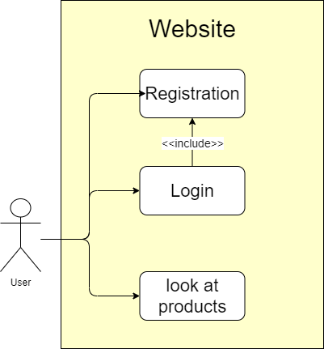

# Website Name
## Use Case Diagram

## Use Case Description

## User Stories

### 1. Story

Hans wants to be able to look at the website without loging in, 
in order to get a first look at the products without having to register.
(functional)

### 2. Story

Hans has long workig hours and doesn't have a lot of free time. 
So he doesn't want to spend a lot of time reistering and trying to understand the website.
(non-functional)

### 3. Story

Hans wants to register himself and then be able to log in during later sessions, 
this way he can use the full functionality of the website.
(functional)

### 4. Story

Hans doesn't want his private data to be public, 
so he relies on the website to keep his personal details private.
(non-functional)

### 5. Story

One day Hans returns to the website and can't log in because he forgot his password,
but luckily there is an option for him to change his password. Better remember it this time!
(functional)

## Functional Requirements

- Registartion: A user has to be able to register, 
this data needs to be stored and accessible the next time the user visits the website.
- Login: A user has to be able to login, after he has registered himself earlier,
by using his username/email and password.
- Viewing Website: A user needs to able to look at the website without beeing logged in. 

## Non-Functional Requirements

- Privacy: The stored user data must be kept private and only be accessible for the user.
The user may ask for the data to be deleted.
